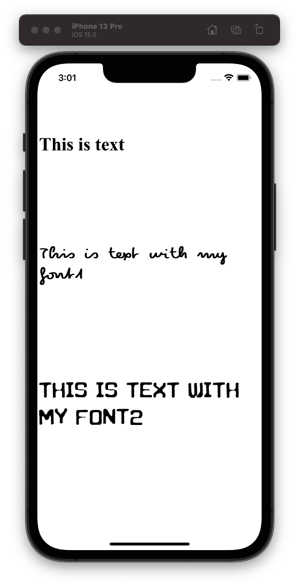

# WebViewCustomFont

WKWebView extension to addScript for inject a custom font-face

```swift
webView.injectScript(fontFileName: "Pecita", type: .otf, fontFamilyName: "pecita")
webView.injectScript(fontFileName: "zagreb_underground", type: .ttf, fontFamilyName: "zagreb")
```



## Requirements

iOS 11

## Swift Package Manager

The [Swift Package Manager](https://swift.org/package-manager/) is a tool for automating the distribution of Swift code and is integrated into the `swift` compiler. It is in early development, but Alamofire does support its use on supported platforms.

Once you have your Swift package set up, adding Alamofire as a dependency is as easy as adding it to the `dependencies` value of your `Package.swift`.

```swift
dependencies: [
    .package(url: "https://github.com/ssauma/WebViewCustomFont.git", .upToNextMajor(from: "0.1.0"))
]
```

## CocoaPods

WebViewCustomFont is available through [CocoaPods](https://cocoapods.org). To install
it, simply add the following line to your Podfile:

```ruby
pod 'WebViewCustomFont'
```

## Author

Juyeon Lee, juyeonlee@me.com

## License

WebViewCustomFont is available under the MIT license. See the LICENSE file for more info.
